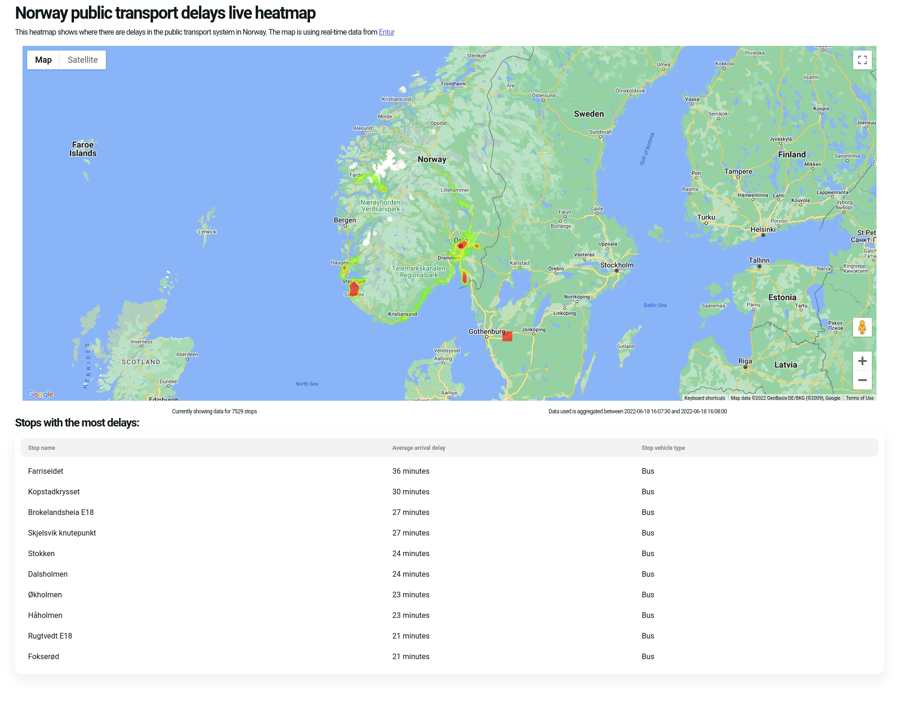
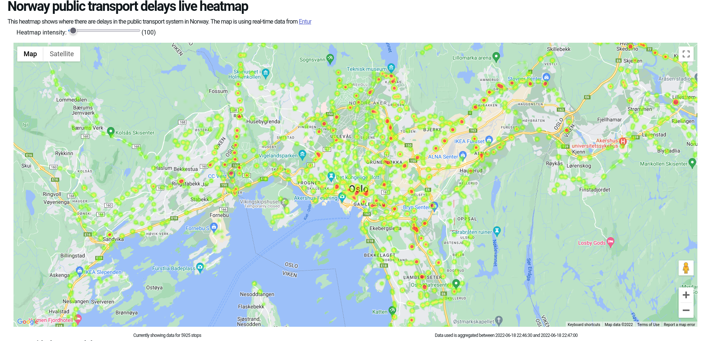

\maketitle

**Project repository**: <https://github.com/LudvigHz/RTBDP-project>

**Git tag**: v1.0.0 (<https://github.com/LudvigHz/RTBDP-project>)

\setcounter{tocdepth}{1}
\tableofcontents

# Abstract

The basis of this project is to create an application using and visualizing the processing of some
real-time data. For my project I have chosen to use the Entur real-time API as my data-source, and
do some processing based on the data provided by the API. The data will then be visualized in a
web application.

The project aims to primarily use the data processing libraries Apache Kafka and Apache Flink as the
backbone of the project. The processing will be done using the Flink Table API, together with the
Kafka table API connector to interface with kafka for consuming and producing data.

\newpage

# Domain

The purpose of this application is to use real-time data on the norwegian public transport system,
specifically the delays of transport lines (buses, trains, trams, ferries) and aggregate all
transport lines and show the relation of delays in the transport system in relation to geographical
data.

# Data source

The data source used for this project is the Entur real-time API[^entur-api]. Entur is a
state-owned, neutral company
that collects data on all public transport companies in Norway, and provides this data
in a united fashion to users, both individual and commercial. They also provide services for journey
planning, ticketing systems and all the digital infrastructure needed to operate a service relating
to the public transport system. All public transport companies in Norway are required by law to
provide data to Entur, so we can count on the data being extensive and correct.

[^entur-api]: <https://developer.entur.org/pages-real-time-intro>

## The real-time API\label{sec:api}

Entur provides extensive real-time data through several APIs.

Enturs real-time data feeds are available in a couple of different formats: GTFS-RT, SIRI and SIRI
LITE. SIRI is the main format provided, as this format is a European standard for exchanging
real-time data regarding public transport operations. This API provides a publish/subscribe method
as well as request/response. Both of these methods allow the user to only receive new updates for
each new data set, and avoids receiving an entire data set if there only are updates to parts of the
data. The publish/subscribe method requires the user to have an open endpoint to receive updates
from the API. The SIRI data is divided into data sets:

- ET: Estimated Timetable
- VM: Vehicle monitoring
- SX: Situation exchange

All the data delivered using SIRI is in XML.

The other main format for the data is in GTFS-RT. GTFS realtime is a similar specification that
allows the exchange of transport information. This data is only available using request/response and
there is no method to only receive updates for a request, so the entire dataset is returned for
every request. Similar to the SIRI format, this data s divided into three data sets:

- Trip updates
- Vehicle positions
- Service alerts

GTFS-RT is published under the Apache 2.0 license, but is in large parts developed and maintained by
Google as it is used extensively in Google Maps, and most likely other google services.

GTFS-RT is delivered in the format of _Protocol Buffers_[^protobuf]. This data format is a special
format that uses a definition file that to generate a library for the language you want to use. So
classes, functions and types are generated for Java, Python, Go and more based on the protocol
definition file. The generated library can then be used to parse data conforming to the definition
file to create and populate the language specific data structures.

[^protobuf]: <https://developers.google.com/protocol-buffers/>

So, there are several choices on which data format to use. At first glance, it would seem obvious to
use the SIRI format, since this is deduplicated and more fleshed out. Especially for an application
whose purpose is to process large amounts of data with high throughput, this ability will increase
performance a lot. However, the documentation provided for the SIRI format is extremely lacking,
almost non-existent, to the point where I do not want to touch it. With the fact that the
documentation provided by Google on the GTFS format, as well as ease of use with the protocol
buffers compared to an undocumented XML API, makes the GTFS API much more compelling.

It should also be noted that the GTFS API only provides data for 3 transport companies, compared to
ca. 15 for SIRI.

## GTFS

The API used for this project is thus the GTFS Trip updates API. This API provides data on delays,
cancellations and changed routes in the GTFS-RT format.

A single call to the API yields a ~2.5MB response encoded using protocol buffers. So, even with just
a small subset of the total data available in SIRI, the data sets are very large, and a lot larger
when decoded, which is around 4.5MB as plaintext.

The GTFS API is updated by Entur every 15 seconds. The performance is good, with reliable 1-3
seconds to download the data on a ~50Mbps line located in Bolzano.

# Architecture & Technologies

## Technologies

The project uses Kafka as the message queue and the Flink Table API for processing. To visualize the
data, I hav created a web application using Next.js[^nextjs]. The web application subscribes to a
kafka topic containing the processed data using websocket though a proxy application using
`kafka-ws-proxy`. The data producing and processing consists of two applications: A _producer_ and
a _processor_. Both of these applications are implemented in python.

[^nextjs]: <https://nextjs.org>

To run kafka, a `docker-compose` stack is used to run the different components required to use
kafka. Mainly, we run `zookeeper` and a kafka `broker`. For development ease there is also an
instance of `kafka-ui` running that can be used for monitoring and debugging.

### Producer

The producer is written in python and uses a ready-to-use library for GTFS-RT
(`gtfs-realtime-bindings`), the `confluent-kafka` library, and the well-known `requests` library to
interface with the Entur API

### Processor

The processor uses pretty-much solely `pyflink` to implement the processing. It also uses the
flink-sql-connector-kafka to be able to talk to kafka. This is provided in the form of a jar file
that is loaded by the python script.

### Web app

The web app is a next.js project that uses the google maps client library and API to visualize the
data on a map. The application is very simple and uses some libraries from the NPM ecosystem for UI
components and date and time parsing. The web application interfaces with kafka using websockets.
The way this is done, is using a separate node.js application that just provides a simple
websocket proxy to kafka using the `kafka-proxy-ws` library. This library is quite old and
unmaintained, but for a lack of better options, this library does the job perfectly and provides a
reliable interface to kafka.

## Architecture


The diagram in \cref{fig:diagram} shows a simple diagram of the different components composing the
application. As can be seen in the diagram, the whole pipeline starts with the producer. Using
polling, it fetches updated data from Entur at a set interval. The data is then decoded and
processed. Due to the way the data is laid out and the available processing techniques provided by
flink, the whole message is split up so that we send a single message to the `trip-updates` kafka
topic per stop update, per transport line in the message. This means that a single message from
Entur is converted into around 70 000 messages.

The processor uses the Flink Table API with the kafka connector to create a table for the
`trip-updates` topic in the flink processing pipeline. The processor then aggregates the data using
a tumble function to find the average arrival and departure delay for each unique transport stop.
The aggregated data is joined with static data that contains more detailed stop information for all
transport stops in Entur's registry and pushed to kafka again, this time on the `avg-trip-delays` topic. This data is just a static file downloaded from entur that is
loaded into a separate table in the flink processor. This data importantly contains coordinates for
each stop, so that we can use the aggregated data with the map in the web app.

The Web application then subscribes to the `avg-trip-delays` topic via the websocket proxy. The data
is loaded and updated in a state in the webapp, so that the data is always updated and reflected in
the application. The webapp creates weighted geographical points based on the delay values. These
are then fed into the google
maps heatmap visualization API and overlayed over a normal map.

## Workflow

The application requires no manual intervention once it is loaded and started. Since the goal of the
application is solely to display real-time data and has no options for what is displayed.


The data processing is, as previously mentioned, handled by the `processor` using the Flink Table
API. The processing API is visualized in \cref{fig:pipeline}. The pipeline does not have that many
steps and is quite simple. The simplicity is due to the fact that we split the data into smaller
messages that make it more easy to work with already in the producer (more about this in the last
section).

The main part of the processing pipeline is quite simple. First off, we create the source table wit
the kafka connector, as well as the table for the stop data using the filesystem connector. Lastly
we also create the sink `avg-trip-delays` table for the resulting data. Then the whole processing is
done in a single query: \\

```sql
SELECT
    `stopId`,
    `stop_name`,
    `stop_lat`,
    `stop_lon`,
    `location_type`,
    `vehicle_type`,
    `avg_departure_delay`,
    `avg_arrival_delay`,
    `window_start`,
    `window_end`
FROM (
    SELECT
        `stopId`,
        AVG(JSON_VALUE(
            `departure`,
            '$.delay' RETURNING INTEGER DEFAULT 0 ON EMPTY)
        ) AS `avg_departure_delay`,
        AVG(JSON_VALUE(
            `arrival`,
            '$.delay' RETURNING INTEGER DEFAULT 0 ON EMPTY)
        ) AS `avg_arrival_delay`,
        `window_start`,
        `window_end`,
        COUNT(*) as `count`
    FROM TABLE(
        TUMBLE(TABLE Stop_updates, DESCRIPTOR(ts), INTERVAL '30' SECONDS)
    )
    GROUP BY `stopId`, `window_start`, `window_end`
)
INNER JOIN Stops ON stopId = Stops.stop_id
```

This query does a couple different steps, and we can group it into a few parts:

1. Group the data into windows, and group by stopId. We use the `TUMBLE` function in Flink to create
   a tumbling window of length 30 seconds.
2. Select the average of the departure and arrival delay from the grouped and windowed data.
3. Join the aggregated data with the `stops` table to add geographical data and other metadata to
   each stop.
4. Select the appropriate columns from the aggregated and joined data, so we can insert into the
   sink table.

# Functionality

The functionality of the application is quite simple. I originally hoped to acheive more options,
but the scope of the main goal of visualizing the delay data on the map turned out to be extensive
enough. We can also show this data in a couple of different ways and not just with the map.

The web application is very simple with just two components:

- A map, centered in Oslo, with a heatmap of the delays overlayed
- A table showing the top 10 stops with the highest average delay



\cref{fig:webapp} shows the web application. We can see that there are just the two components, as
well as some headers and a short sentence explaining the data. There is some information about the
number of stops used in the map as well as the timestamp of the data used.

The user can also zoom in and out of the map and the heatmap layer will adjust accordingly, showing
the data more detailed for single stops and hotspots.

Both the map and the table will update in real time when there is pushed new data to the kafka
topic.



The user can also use a slider to increase/decrease the intensity of the heatmap points. This is
useful when zooming in on an area to show the difference in a more granular matter since there can
be a huge difference in delay of all the points on the map, but a very small difference within most
points in an area, meaning the small differences won't be displayed very well. We can see this in
\cref{fig:oslo} when we set the max intensity to `100` and zoom in to Oslo center.

We can also note that the heatmap overlay is very localized in a couple of population zones and
large motorways. There is neither almost no data north of Oslo. This is due to the issues outlined
in \cref{sec:api} and the fact that only one citys major transport companys data is included, in
addition to the nation-wide company operating railways and some inter-regional bus lines.

We can assume that the heatmap would have been a bit more interesting if we had data from other
regions transport companies, but this is hard to predict before the actual application is finished
and we can see the result.

# Lessons learned

## Data size and thoughput

The Entur data set is massive, even when using the GTFS API, which is missing most of the
transportation companies in Norway. Dealing with this data is very difficult and configuring the
options for kafka to get the right balance of throughput, buffer size, lag time and retention
requires more knowladge than one can obtain from just a few weeks of working with these types of
libraries and systems. A lot of reading on the inner workings of kafka and all the different options
was needed to make the system work, and still there are several problems with the applicaion.
Notably it will stop producing data after a while due to the producer buffer filling up and a
restart is required to get it going again. I think the documentation and guides for newcomers to
kafka and big data streaming is lacking and too difficult to understand. Still, every project is
different, with different requirements for thoughput and data retention etc. So it is understandable
that Kafka needs to be _very_ configurable in order to suit all the needs of different users.

## Data format

Another learning point goes to how to manage the data and the relation of the producer and
processor. Initially, I wanted to just send the raw data from entur straight to the Kafka topic,
still encoded with protocol buffers. Since Kafka supports data endoded using protocol buffers and it
is possible to upload `.proto` defenitions to the schema registry, this seemed like a good in order
to maintain high thoughput with minimal overhead, since the data is almost unchanged. However, there
was no trivial way to decode the protocul buffer data in flink, at least not in python. If I had
used Java, it seemed possible to create a custom consumer using the protbuf library to decode the
data, but since I wanted to use python, there did not seem to be a way to do this.

It also seemed
impossible to associate a message that is sent pre-encoded to a specific schema in the schema
registry. This seems like a very obvious downside to me, as you apparently have to use a producer
that both encodes the data and automatically associates a message to a schema to be able to make use
of it.

With this, I decided to decode the data to JSON in the producer and send the whole dataset in one
message as JSON to the kafka topic. The problem then was how to deal with this large dataset and
perform aggregations on a single message in Flink. It was soon obvious that using Flink in this
manner is not what it is designed for, as we want to operate on many, small messages and perform
aggregations and queries accross messages. So I decided to further split and parse the data in the
producer.

The producer then ended up decoding the data, iterating through each _route_ in the data, and each
_stop_ in every single route again, and send this data as its own message to kafka. So with the
processing in the producer, we went from one gigantic message to around 70 000 messages to kafka
from one update from Entur. The smaller messages make more sense, are a lot easier to work with in
Flink, and can also be batched together to decrease the overhead. Still, this means there is quite a
bit of overhead in the processor, but considering we only fetch data every 15 seconds, the producer
is never backed up in this regard.

## Conclusion

In hindsight, we can probably assume that many of the issues could be fixed by using the SIRI APIs
instead of the GTFS-RT, which would also have the benefit of delivering more extensive data as well
as having options for paging to reduce the size of each message. But considering the lack of
documentation, it is likely that there would have been a plethora of other difficulties if we went
with the SIRI API. The ideal case would have
been for Entur to deliver streaming data that contains only updates in GTFS-RT format to have the best
of both worlds. This is also supposed to coming later according to Entur:

> Later we will support publish/subscribe and continuous updates.

Despite the issues that still exist, the application does funciton as expected accorcing to the
project proposal, and resulting application meets my own expectations when it comes to features. In
fact, the heatmap is even more interesting then I had hoped for before starting on this project.
